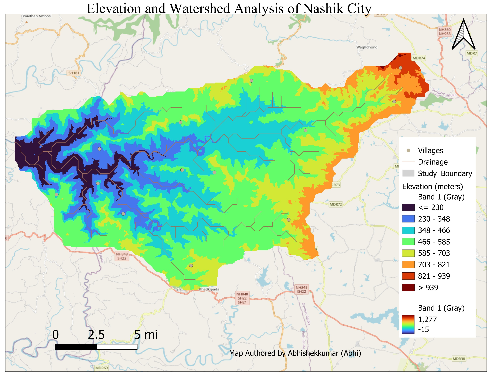

# watershed-analysis
A QGIS project analyzing the elevation and drainage of a watershed in Nashik, India.

# Elevation and Watershed Analysis in Nashik District, India

## Map Preview

*(Note: You will upload your map image and name it 'image_94a6e5.jpg' or update the link here)*

## Project Overview

This project provides a cartographic analysis of a watershed located in the Nashik District of Maharashtra, India. The map visualizes the region's topography using a Digital Elevation Model (DEM) combined with a hillshade effect to create a 3D-like relief. Key features include the delineated watershed boundary, the local drainage network (rivers and streams), and the location of nearby villages.

The primary goal was to analyze the terrain's characteristics and understand the relationship between elevation, water flow, and human settlement in this part of the Western Ghats.

## Analytical Insights

From the map, we can derive several key insights:
* **Topography:** The elevation ranges from below 220 meters (dark blue) to over 939 meters (bright red). The terrain is highest in the eastern portion of the watershed and gradually slopes down towards the west.
* **Drainage Pattern:** The drainage network shows a dendritic pattern, which is typical for this type of terrain. Streams and rivers originate in the high-elevation eastern areas and flow westward, converging into larger channels as the elevation decreases.
* **Settlement Location:** The "Villages" points are predominantly located along the drainage lines in the lower and mid-elevation areas, highlighting the critical role of water access for human settlement.

## QGIS Methodology & Tools

This map was created entirely using **QGIS**, a free and open-source Geographic Information System.

1.  **Data Acquisition:**
    * **Digital Elevation Model (DEM):** The primary raster data was likely sourced from a public repository like the USGS EarthExplorer (SRTM or ASTER GDEM).
    * **Vector Data:** Drainage, village locations, and the study boundary were either digitized or sourced from government portals like Bhuvan or Survey of India.
    * **Basemap:** An OpenStreetMap XYZ Tile layer was used for contextual information like roads and place names.

2.  **Raster Analysis & Visualization:**
    * **Hillshade:** The `Raster -> Analysis -> Hillshade` tool was used on the DEM to create a grayscale layer that simulates lighting and shadows. This adds texture and a sense of depth to the terrain.
    * **Color Ramp (Hypsometric Tinting):** The original DEM was styled using a color ramp (`"Viridis"` or similar) to represent elevation changes visually. The DEM layer was then placed *on top* of the hillshade layer, and its layer transparency was set to around 40-50%. This allows the hillshade texture to show through the colors, a standard technique for beautiful relief maps.

3.  **Cartographic Production:**
    * **Print Layout:** QGIS's `Print Layout` was used to design the final map.
    * **Map Elements:** All standard cartographic elements were added within the layout, including:
        * A descriptive title.
        * A North Arrow for orientation.
        * A dynamic Scale Bar.
        * A Legend, which was manually edited to be more readable (e.g., renaming `Clip_DEM` to "Elevation (meters)").

## Data Layers
* `Elevation`: A raster layer showing elevation in meters.
* `Hillshade`: A raster layer used for 3D effect.
* `Drainage`: A line shapefile representing the river and stream network.
* `Villages`: A point shapefile showing settlement locations.
* `Study Boundary`: A polygon shapefile delineating the watershed.

## Future Improvements
* The legend could be further cleaned to remove the second "Band 1 (Gray)" entry.
* Perform a slope analysis (`Raster -> Analysis -> Slope`) to quantify the steepness of the terrain.
* Run a Viewshed Analysis from a high point to see what areas are visible.
